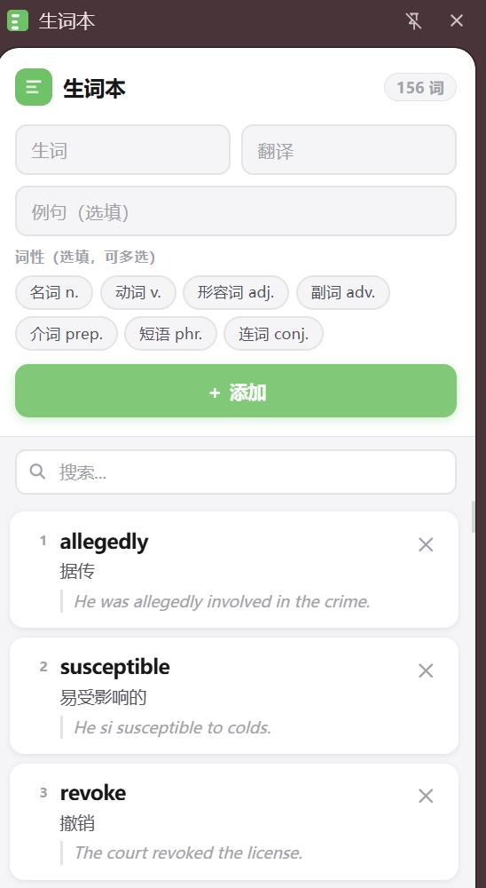

# 📚 Vocabulary Notebook (Chrome Extension)

> 一个简洁高效的浏览器生词本插件 —— 随手记录单词，打造你的专属词汇库

---

## ✨ Features

* 📖 **一键添加生词**：快速记录网页中的陌生单词
* 🧠 **完整词条信息**：支持添加释义、例句、词性
* 🗂️ **本地词库管理**：所有数据保存在浏览器本地，安全轻量
* 🔍 **快速搜索**：支持关键词查找已保存单词
* ✏️ **编辑 / 删除**：随时修改词条内容
* 🎯 **极简 UI**：专注学习，无干扰设计

---

## 🖼️ Preview

> 

---

## 📦 Installation

### 本地加载（开发者模式）

1. 下载或克隆项目：

```bash
git clone https://github.com/1829317945/vocab-simple.git
```

2. 打开浏览器扩展管理页面：

* 在 Google Chrome 地址栏输入：`chrome://extensions/`

3. 开启右上角「开发者模式」

4. 点击「加载已解压的扩展程序」

5. 选择项目文件夹

---

## 🚀 Usage

1. 点击插件图标
2. 填写：

   * 释义（Meaning）
   * 例句（Example）
   * 词性（Part of Speech）
3. 保存到生词本

👉 随时打开插件查看你的词汇积累

---

## 🧩 Data Structure

每个单词结构示例：

```json
{
  "word": "example",
  "meaning": "示例；例子",
  "example": "This is an example sentence.",
  "partOfSpeech": "noun",
  "createdAt": "2026-05-04"
}
```

---

## 🤝 Contributing

欢迎提交 Issue 或 PR！

如果你有好的想法：

* 提出功能建议
* 优化 UI / UX
* 修复 Bug

---

## 📄 License

MIT License

---

## 💡 Inspiration

灵感来源于日常阅读中频繁遇到生词，希望打造一个：

> **“随手记录 + 轻量复习”的词汇工具**

---

## ⭐ Support

如果这个项目对你有帮助，欢迎点个 Star ⭐

---

